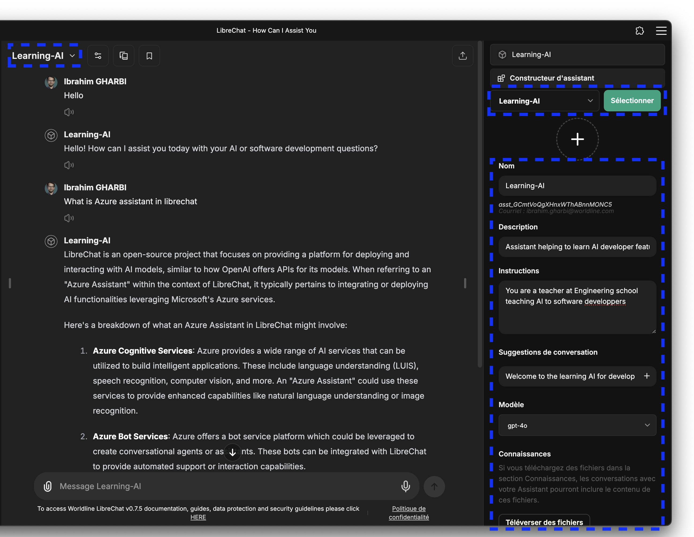
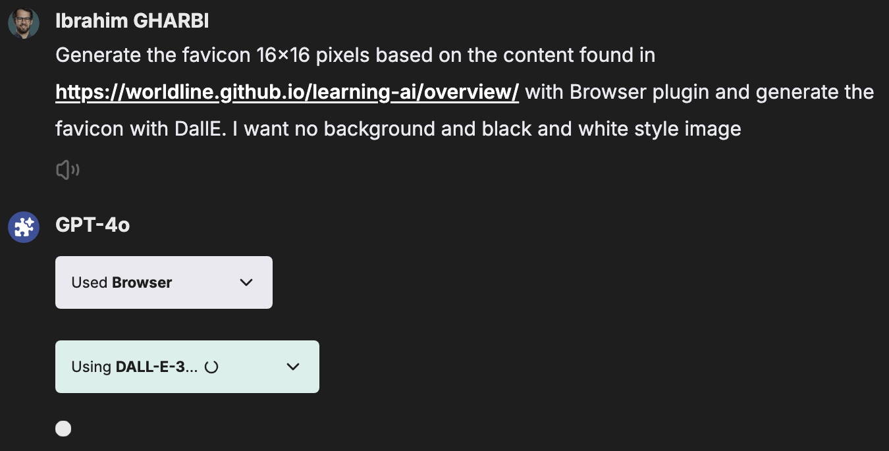

# Online with Librechat


LibreChat is a free, open source AI chat platform. This Web UI offers vast customization, supporting numerous AI providers, services, and integrations. Serves all AI Conversations in one place with a familiar interface, innovative enhancements, for as many users as you need.

The full librechat documentation is available [here](https://www.librechat.ai/docs)

Let's discover how to use LibreChat to create efficient and effective conversations with AI for developers.

## Prompts history
Prompts history allows users to save and load prompts for their conversations and easily access them later. Reusing prompts can save time and effort, especially when working with multiple conversations and keep track of the context and details of a conversation.

## Favorites
The favorites feature allows users to save and load favorite prompts for their conversations and easily access them later.

## Presets
The `presets` feature allows users to save and load predefined settings for initialise a conversations. Users can import and export these presets as JSON files, set a default preset, and share them with others.

## Preformatted prompts 
The prompts feature allows users to save and load predefined prompts to use it during their conversations.
You can use a prompt with the /[`prompt command`]. A prompt can have parameters, which are replaced with values when the prompt is used.

**Exemple of preformatted prompts : Explain the following code snippet in Java, Kotlin or Javascript**

* Click on the `+` button to add a new prompt.
* name your prompt : `explain`
* on Text tab, you can write your prompt :
```
Explain the following {{language:Java|Kotlin|Javascript}} snippet of code: 
{{code}}
```


* Now you can use the `/explain` command to get the explanation of the code snippet.


## AI providers 

### Azure OpenAI
Azure OpenAI Service provides REST API access to OpenAI's powerful language models, including the o1-preview, o1-mini, GPT-4o, GPT-4o mini, GPT-4 Turbo with Vision, GPT-4, GPT-3.5-Turbo, and Embeddings model series.

### Google Gemini
Gemini is a large language model (LLM) developed by Google.  It's designed to be a multimodal AI, meaning it can work with and understand different types of information, including text, code, audio, and images. Google positions Gemini as a highly capable model for a range of tasks, from answering questions and generating creative content to problem-solving and more complex reasoning.  There are different versions of Gemini, optimized for different tasks and scales.

### Anthropic Claude
Claude is an Artificial Intelligence, trained by Anthropic. Claude can process large amounts of information, brainstorm ideas, generate text and code, help you understand subjects, coach you through difficult situations, help simplify your busywork so you can focus on what matters most, and so much more.

## Assistants 
The Assistants API enables the creation of AI assistants, offering functionalities like code interpreter, knowledge retrieval of files, and function execution. The Assistants API allows you to build AI assistants within your own applications for specific needs. An Assistant has instructions and can leverage models, tools, and files to respond to user queries. The Assistants API currently supports three types of tools: Code Interpreter, File Search, and Function calling.



## Plugins
The plugins endpoint opens the door to prompting LLMs in new ways other than traditional input/output prompting.

::: warning 
Every additional plugin selected will increase your token usage as there are detailed instructions the LLM needs for each one
For best use, be selective with plugins per message and narrow your requests as much as possible
:::

### DALL-E 3

Dall-e 3 is a librechat Plugin for generating images from text. You can use it to generate images from text, such as product descriptions, product images, or even documentation images to illustrate your technical documentation.

### Confluence
Ask confluence is a librechat Plugin for Confluence documents.

### IT support

Ask for IT support enable you to get support from the IT team and create WLSD tickets from your chats.

### WOLF

`Wolf` is a librechat Plugin for WL Managagement System documents. 
The sharepoint documention is available [here](https://worldline365.sharepoint.com/sites/AAC815)

Ask to WorldLine management system Friend everything you are looking for in the WMS content. 
AskWOLF plugin is meant to help you navigate through the multitude of information provided by the WMS (Applicable Policies, Processes & Procedures, Transversal & Operations SP pages links, …). This Worldline LibreChat plugin relies on ChatGPT technologies.

​​​​​​​Worldline Management System (WMS) is the Group reference for all information pertaining to our operating model such as applicable policies, processes and governance structures.
Key responsibilities are :
- consistently address its customers’ and markets’ requirements across all its geographies
- continuous improvement of customer satisfaction through effective application of WMS
- correct interpretation of applicable ISO standards requirements

Example of prompts:
- AskWOLF: What is the WMS?
- AskWOLF: What are the policies?
- AskWOLF: What are the processes?

### Browse plugins
Retrieve data from internet and use it to generate a response.

## Plugin mixing
You can mix plugins to create more complex prompts. For example, you can use the DALL-E 3 plugin to generate images from text and then use the IT support plugin to get support from the IT team.

```
Generate the favicon 16x16 pixels based on the content found in 
https://worldline.github.io/learning-ai/overview/ with Browser plugin 
and generate the favicon with DallE. I want no background and black and white image
```



## RAG

RAG is possible with LibreChat. You can use RAG to create a conversation with the AI.
To can add files to the conversation, you go to the file tab and select the file you want to add. Then the file will be added to the file manager and you can use it in the prompt.

The file can be an png, a video, a text file, or a PDF file.

## 🧪 Exercises

#### 1. Prompt creation

Select one prompt engineering technique and make a prompt in librechat that can be called with the `/[prompt_name]` command.

#### 2. Plugins mixing

Use the Browse and Dall-E plugins to create a prompt that generates a a favicon based on the content of this learning-ai website.

#### 3. Make your own assistant

Choose your favorite topic ( cooking, travel, sports, etc.) and create an assistant that can answer questions about it. You can share documents, files and instructions to configure your custom assistant and use it.

## 📖 Further readings
* [LibreChat Worldline guides](https://worldline365.sharepoint.com/:u:/r/sites/GenerativeAIQA/SitePages/LibreChat-guides.aspx?csf=1&web=1&e=evKJpU)
* [LibreChat worldline instance](https://librechat.as8677.net/login)
* [LibreChat official website](https://www.librechat.ai/)
* [LibreChat Github repository](https://github.com/danny-avila/LibreChat)
* [Gemini Prompting guide]()
* [Azure search](https://learn.microsoft.com/en-us/azure/search/search-what-is-azure-search)
* [Google programmable search engine](https://programmablesearchengine.google.com/about/)
* [Claude AI](https://www.anthropic.com/)
* [OpenAI Assistant feature](https://platform.openai.com/docs/assistants/overview)