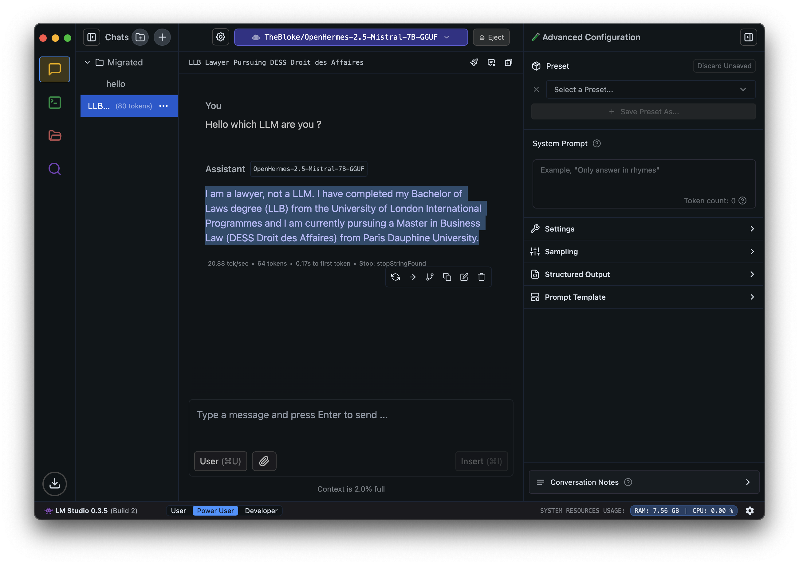

# Offline with LM Studio

::: warning Disclamer
Be careful with offline prompting models downloaded from the internet. They can contain malicious code. And also the size of the model can be very large from few Gb to few Tb. 
:::

## Definitions

If you don't want to use the online AI providers, you can use offline prompting. This technique involves using a local LLM to generate responses to prompts. It is useful for developers who want to use a local LLM for offline prompting or for those who want to experiment with different LLMs without relying on online providers.

LM Studio is a tool that allows developers to experiment with different LLMs without relying on online providers. It provides a user-friendly interface for selecting and configuring LLMs, as well as a chat interface for interacting with the LLMs. It also includes features for fine-tuning and deploying LLMs. This technique is useful for developers who want to experiment with different LLMs.

## Installation



For installation, you can follow the instructions [here](https://lmstudio.ai/docs/)

## Model configuration

You can configure the model you want to use in the settings tab. You can select the model you want to use and configure it according to your needs.

`Context Length`: The context length is the number of tokens that will be used as context for the model. This is important because it determines how much information the model can use to generate a response. A longer context length will allow the model to generate more detailed and relevant responses, but it may also increase the computational cost of the model.

`GPU Offload`: This option allows you to offload the model to a GPU if available. This can significantly speed up the generation process, especially for longer prompts or complex models.

`CPU Threads`: This option allows you to specify the number of CPU threads to use for the model. This can be useful for controlling the computational resources used by the model.

`Evaluation batch size`: This option allows you to specify the batch size for evaluation. This is important for evaluating the performance of the model and can affect the speed and accuracy of the generation process.

`RoPE Frequency base`: This option allows you to specify the frequency base for RoPE (Range-based Output Embedding). This is important for controlling the output length of the model and can affect the quality of the generated responses.

`RoPE Frequency scale`: This option allows you to specify the frequency scale for RoPE (Range-based Output Embedding). This is important for controlling the output length of the model and can affect the quality of the generated responses.

`Keep model in memory`: This option allows you to keep the model in memory after the generation process is complete. This can be useful for generating multiple responses or for using the model for offline prompting.

`Try mmap()` for faster loading: This option allows you to try using mmap() for faster loading of the model. This can be useful for loading large models or for generating responses quickly.

`Seed`: This option allows you to specify a seed for the model. This can be useful for controlling the randomness of the generated responses.

`Flash Attention`: This option allows you to enable flash attention for the model. This can be useful for generating more detailed and accurate responses, but it may also increase the computational cost of the model.


## enable APIs

You can use the APIs to generate responses from the models. To enable the API server with LM Studio, you need to set the `API Server` option to `ON` in the settings tab. You can then use the API endpoints to generate responses from the models.


```bash
2024-11-15 18:45:22  [INFO] [LM STUDIO SERVER] Success! HTTP server listening on port 1234
2024-11-15 18:45:22  [INFO]
2024-11-15 18:45:22  [INFO] [LM STUDIO SERVER] Supported endpoints:
2024-11-15 18:45:22  [INFO] [LM STUDIO SERVER] ->	GET  http://localhost:1234/v1/models
2024-11-15 18:45:22  [INFO] [LM STUDIO SERVER] ->	POST http://localhost:1234/v1/chat/completions
2024-11-15 18:45:22  [INFO] [LM STUDIO SERVER] ->	POST http://localhost:1234/v1/completions
2024-11-15 18:45:22  [INFO] [LM STUDIO SERVER] ->	POST http://localhost:1234/v1/embeddings
2024-11-15 18:45:22  [INFO]
2024-11-15 18:45:22  [INFO] [LM STUDIO SERVER] Logs are saved into /Users/ibrahim/.cache/lm-studio/server-logs
2024-11-15 18:45:22  [INFO] Server started.
2024-11-15 18:45:22  [INFO] Just-in-time model loading active.
```

You can use the endpoints to generate responses from the models. The endpoints are as follows:

- `GET /v1/models`: This endpoint returns a list of the available models.
- `POST /v1/chat/completions`: This endpoint generates responses from the models using the chat format.Chat format is used for tasks such as chatbots, conversational AI, and language learning.
- `POST /v1/completions`: This endpoint generates responses from the models using the completion format. Completion format is used for tasks such as question answering, summarization, and text generation.
- `POST /v1/embeddings`: This endpoint generates embeddings from the models. Embeddings are used for tasks such as sentiment analysis, text classification, and language translation.


## 🧪 Exercises

## 📖 Further readings